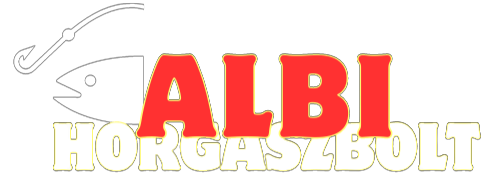

# Albi horgászbolt, E-commerce website project

## Egy horgászbolt webshopjának frontend része, React app Funkcionális programozással. Több oldalas alkalmazás, több funkcióval, kategóriákkal szűrési feltételekkel responzive dizájnnal.

### Technológiák, irányelvek

- React
- Typescript
- SASS, SCSS
- Reactstrap, Bootstrap 5
- Context API
- functional programming
- reszponzív design
- mobile first design

#### React

A projektben használt React technologiák:

- React hooks
- CONTEXT API
- Components (function)
- Typescript TSX
- createContext, useContext, useState, useEffect, ReactNode
- onClick, onBlur

#### Typescript

A projektben használt Typescript technologiák:

- Tipusok Egyszerű adattípusok, Összetett adattípusok
- fugvények, map, filter, find, reduct, sort, Array.from, replace, toString, reverse, Number, String,
- elágazások if, switch
- Spread operátor, destrukturálás

#### SCSS

A projektben használt SCSS technologiák:

- @use, @mixin, @include, @media, @keyframes
- Flexbox, Grid, Positioning, Before-After
- variable, color, font-size, weight, media breakpoints
- reset

